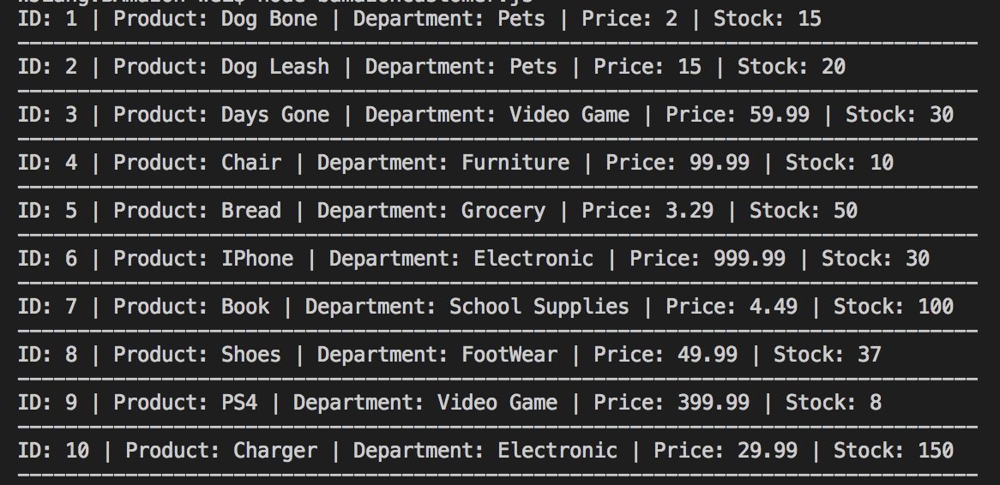
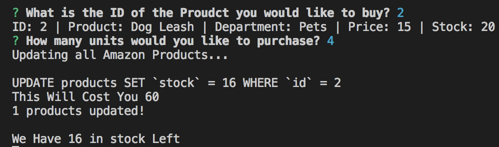
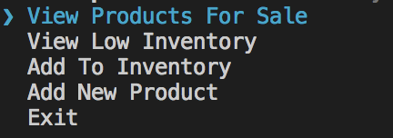
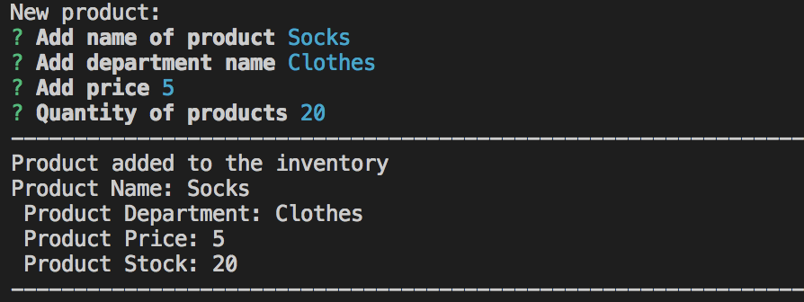

# Node Product Manager (Bamazon)

Bamazon is a product management system, built to interact with Node and MySQL database. This system is divided into seperate programs: ```bamazonCustomer.js``` and ```bamazonManager.js```, Where the user can access as a customer to purchase products from Bamazon or the user can access the managers page and restock products.

### Technologies
* Node.js
* MySQL

## Video

## Installation
You will need to install the package.json with the following command
```bash npm install```

## Functions
On your bash terminal preform the following command to access the Customer or Manager application. 
```node bamazonCustomer.js``` or ```node bamazonManager.js```

## Bamazon Customer
When the customer runs ```node bamazonCustomer.js``` it will display all available products.



Then the User will be allow to search the ID of the product the User would like to purchase. Then they can enter the amount the User wants to buy. Afterwards the server will display the total cost, and the amount of stock left.



## Bamazon Manager
When the manager runs ```node bamazonManager.js``` it will display the following options.



The manager can also view all the products, as well as adding a new product to the inventory. 


